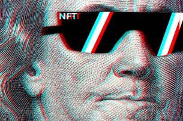

# dsignbykeen.io
<!DOCTYPE html>
<html lang="en">
    <head>
        <meta charset="UTF-8">
        
        <title>NFT Assignment</title>
   
        <link rel="stylesheet" type="text/css" href="./css/css.css">
        <link rel="preconnect" href="https://fonts.googleapis.com">
        <link rel="stylesheet" href="https://cdnjs.cloudflare.com/ajax/libs/font-awesome/4.7.0/css/font-awesome.min.css">
        <link rel="preconnect" href="https://fonts.gstatic.com" crossorigin>
        

      <link rel="stylesheet" href="https://cdnjs.cloudflare.com/ajax/libs/font-awesome/4.7.0/css/font-awesome.min.css">
    
    

</head>
    <body>
       <!-- <header>
           

              
            

        </header> -->
              
       <section>
           

           

          <nav >
            
 
                <ul>
                    <li><a class="active" href="index.html">Home</a></li>
                    <li><a href="What is NFT.html">What is NFT</a></li>
                    <li><a href="characteristic.html">Characteristic</a></li>
                    <li><a href="history.html">History</a></li>
                </ul>
            
 
            
Yekeen Page 
            

         </nav>
        </section>
        
        <section class="showcase">
            

                
             
     
                <h3 class="welcome">
                     ...a brief review on NFT <i>by Yekeen Abdul-Ghaniyu</i>
                 </h3>
        </section>
            
       
        

                <h2>INTRODUCTION</h2>
                

                    
                
     
                

                 A lot of people have so many questions on the current <em>digital trend</em> and why traders are willing to pay a pot of gold for such art forms. Digital arts such as video,audio,and photos are not the only valuables traded, it is fascinating that any digital work can be sold for a huge amount of money such as tweets. <em>Wait!</em> you mean i can trade my tweets? Ofcourse, Sina Estavi, a crypto enthusiast purchased Jack Dorsey's first tweet for <em>$2.9 million</em>. This is bewildering for most people, considering the fact the tweet could be deleted at any given time by the user or Twitter company. NFT is a non-fungible token,NFT does not give the buyer the copyright to the original art or media, the token to the original art or media is what you own which is stored in blochain, the token can be traded,or displayed for auction.
                 <em>Now, let's dive deeper into what NFT generally entails...</em> 
                

            

        </section>  
    </body>
             
   
    

       
        

           
<h3>About</h3>
            
This blog is a final assignment on Modern Day Web Design course, code written and design by Abdul-Ghaniyu.

                
<i>See</i> Wikipedia contributors. Non-fungible token. Wikipedia, The Free Encyclopedia. June 6, 2022, 01:49 UTC. Available at: <a href="https://en.wikipedia.org/w/index.php?title=Non-fungible_token&oldid=1091735010" target="blank">Wikipedia,Non-fungible token. Wikipedia, The Free Encyclopedia</a>.Accessed June 10, 2022.

           

           
<h3>Site Map</h3>
            <ul>
                <li><a class="active" href="index.html">Home</a></li>
                <li><a href="What is NFT.html">What is NFT</a></li>
                <li><a href="characteristic.html">Characteristic</a></li>
                <li><a href="history.html">History</a></li> 
            </ul>
        

        

            <h3>Socials</h3>
            <a href="twitter.com" class="fa fa-twitter" target="blank">  @yekingthelion</a>
            <a href="instagram.com" class="fa fa-instagram" target="blank"> @ibn.yeqeenn</a>
            <a href="gmail.com" &phone class="fa fa-envelope" target="blank"> morounmuboyekeen @gmail.com</a>
        

           
<h3>Email</h3>
        
We would love to read your suggestion on our we can improve our design

            Kindly enter your name,email,and comment below

            <form>
                
 
                <ul>
                <li>Name:<input type="text" name="name" placeholder="enter name"></li> 
                <li>Email:<input type="text" name="email" placeholder="enter email" ></li> 
                <li>Comment:<input type="textarea" name="textarea" placeholder="type message"></li> 
                <li><input type="submit" value="Send" Style="background-color:rgb(51, 238, 51)" ></li>

                </ul>
            </form>
        

       

    

       
       <section class="copyright-section">
        
Copyright &copy YekeenPage 2022

       </section>

</html>
